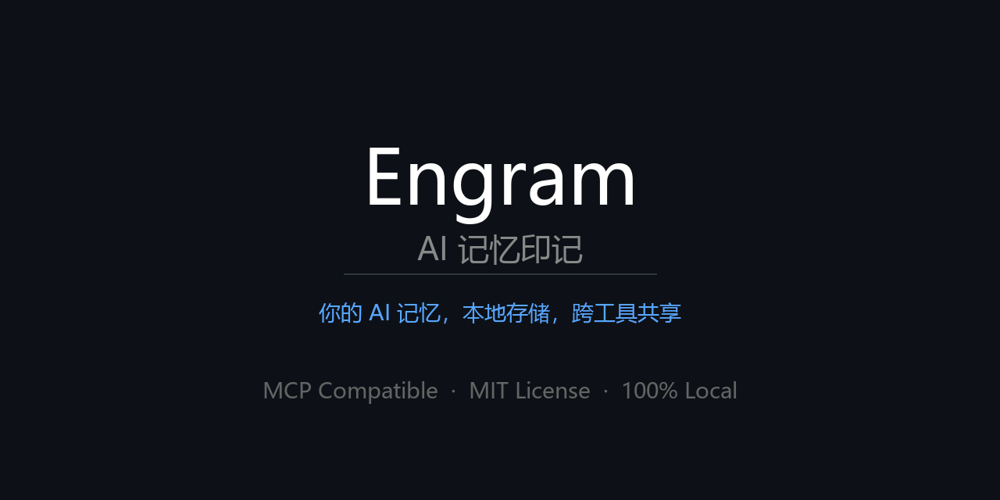

<div align="center">



# Engram

### Your AI knows your code. It doesn't know *you*. Engram fixes that.

**A local identity layer that makes every AI tool start from the same understanding of who you are.**

`Claude Code` | `Codex` | `Cursor` | `MCP compatible` | `100% local`

[ENGLISH](README.md) | [中文](README.zh-CN.md)

[](LICENSE)
[](https://python.org)
[](https://modelcontextprotocol.io)
[](https://pypi.org/project/piia-engram/)

</div>

---

> **TL;DR:** Engram is a local identity layer for AI tools — not session memory, not an agent framework, not a hosted database. It stores who you are (profile, preferences, lessons learned, key decisions) as local JSON files on your machine, and exposes them through MCP so every AI tool reads the same you. One write, every AI reads. 100% local, Apache 2.0.

---

AI coding tools are powerful, but they don't know *you*.

Every time you open a new chat window, switch from Claude Code to Codex, update your AI tool, or move into a different project, you're back to zero:

- your communication preferences — gone
- your code standards and quality bar — forgotten
- which mistakes you've already learned from — lost
- why you made that architecture decision last month — erased

This happens because AI memory today is locked inside each platform. It belongs to the tool, not to you. The tool updates, resets, or gets replaced — and your context disappears with it.

**Engram gives you a personal identity layer that lives on your machine, independent of any AI tool.** You tell it once who you are, how you work, and what you've learned. Every MCP-compatible tool reads the same context. New chat, new tool, new version — your identity persists.

> **Engram is not an agent memory database.** Tools like Mem0, Zep, and Letta store task context and session history for AI agents. Engram stores *who you are as a person* — your identity, preferences, hard-won lessons, and key decisions. It's a different layer: not what happened in a task, but who is behind every task.

## Why Engram?

| Without Engram | With Engram |
|---|---|
| New chat window = start from zero | Every conversation already knows you |
| AI tool updates and your preferences vanish | Your identity lives on your machine, survives any update |
| Switching tools loses accumulated context | Claude Code, Codex, and Cursor read the same memory |
| Past mistakes get repeated | Lessons learned follow you across tools and sessions |
| Memory is locked inside one product | Data stays local, editable, and portable |

## Who Uses Engram

Engram is built for developers who use multiple AI coding tools and are tired of re-explaining themselves.

**If you switch between Claude Code, Codex, and Cursor** — your code standards, architecture decisions, and hard-won lessons reset every time. Engram makes every tool start from the same understanding of who you are.

**If you open 10+ AI chat windows a week** — each one starts from zero. Engram gives every conversation your full context from the first message.

**If you've lost preferences after a tool update** — your identity lives on your machine, not inside any platform. Updates, resets, and migrations don't touch your memory.

<details>
<summary><strong>Other use cases</strong></summary>

**Investment analysts**
Decisions get made but reasoning gets lost. Engram stores the full reasoning chain so six months later, "why did I pass on that?" has a real answer — and your analytical framework travels with you across every new analysis.

**System architects**
Architecture decisions need context: what you chose, what you ruled out, and why. Engram keeps living Architecture Decision Records that travel with you across companies and projects, queryable by any AI tool.

**Backend developers**
API quirks, integration gotchas, performance trade-offs — tacit knowledge that normally lives in your head and resets when you change jobs. Engram turns it into a searchable library that persists across everything.

**Frontend and design**
Design philosophy rarely gets documented in a way AI tools can use. Engram stores your real standards, UX lessons from real users, and the reasoning behind component decisions — so every project starts where your last one ended.

**Vibe coders**
You build with AI and move fast. The problem: every new session your AI starts from scratch — different style choices, inconsistent patterns, re-explaining the same preferences. Engram makes every tool consistent from session one: your stack, your patterns, your voice, already there.

</details>

## What Engram Stores

All data lives under `~/.engram/` as plain JSON and Markdown files you can open, edit, back up, or migrate yourself.

- **Identity**: who you are, how you communicate, what languages you prefer
- **Quality standards**: your code review bar, test coverage expectations, what you refuse to ship
- **Preferences**: coding style, AI behavior, how you like explanations
- **Trust boundaries**: which fields to keep private, what tools can access
- **Project snapshots**: context for ongoing work, captured and reloadable
- **Lessons learned**: mistakes, surprises, things that worked and didn't
- **Key decisions**: what you chose, what you ruled out, and why
- **Domain knowledge**: reusable insights across projects and tools

## What Engram Does (Beyond Storage)

Most memory tools are passive — you put things in, they give them back. Engram is also active.

**Knowledge inheritance across projects**  
Describe a new project in plain text. `get_knowledge_inheritance` returns a curated starter pack of the most relevant lessons and decisions from everything you have ever worked on. Your tenth project benefits from all nine before it — automatically.

**Passive knowledge capture**  
Paste a session summary into `extract_session_insights` and Engram automatically extracts and stores the lessons and decisions. No manual note-taking. Knowledge accumulates even when you are not thinking about it.

**Works with tools that do not support MCP**  
ChatGPT, Gemini, Kimi — `get_identity_card` exports a ready-to-paste Markdown identity card. Your context travels even to tools that cannot connect directly.

**Knowledge health and discovery**  
`get_knowledge_overview` surfaces stale lessons (not reviewed in 90+ days), gives a health score, and flags gaps worth revisiting. `find_similar_knowledge` finds overlapping items to merge. `link_knowledge` connects related lessons and decisions into a navigable knowledge graph.

## Local Setup

Run Engram on your own machine. Data stays in `~/.engram/`, AI tools connect over stdio.

```bash
git clone https://github.com/Patdolitse/engram.git
cd engram
pip install piia-engram      # Install from PyPI (recommended)
# Or install from source: pip install -e .
python demos/setup_engram.py
```

Add to your AI tool's MCP config:

```json
{
  "mcpServers": {
    "engram": {
      "command": "python",
      "args": ["/path/to/engram/src/engram_core/mcp_server.py"]
    }
  }
}
```

Restart your MCP-compatible client. A new session will call `get_user_context` automatically.

## Upgrading

```bash
pip install --upgrade piia-engram
```

After upgrading, Engram automatically migrates any stale MCP configs the next time its server starts (stdio mode). If your AI tool still shows an "MCP disconnected" error after restarting, run:

```bash
engram doctor        # show what's wrong
engram doctor --fix  # auto-repair and fix in one step
```

Then restart the affected AI tool. The doctor command checks Claude Code, Cursor, and Claude Desktop configs and removes any outdated server entries.

## Remote Deployment

Run Engram on your own server and connect from anywhere.

### Server Setup

```bash
# Install with remote support
pip install piia-engram[remote]

# Generate an auth token
python -c "import secrets; print(secrets.token_urlsafe(32))"
# Save the output, e.g. "abc123..."

# Start in SSE mode
ENGRAM_AUTH_TOKEN=abc123... python -m engram_core.mcp_server --transport sse --host 0.0.0.0 --port 8767
```

### Client Config (Claude Code)

```json
{
  "mcpServers": {
    "engram": {
      "url": "http://your-server:8767/sse",
      "headers": {
        "Authorization": "Bearer abc123..."
      }
    }
  }
}
```

### Client Config (Cursor)

```json
{
  "mcpServers": {
    "engram": {
      "url": "http://your-server:8767/sse",
      "headers": {
        "Authorization": "Bearer abc123..."
      }
    }
  }
}
```

**Security notes:**
- Always use HTTPS in production, behind nginx or caddy with TLS.
- The auth token protects your identity data. Keep it secret.
- Default bind is `127.0.0.1` for localhost only. Use `0.0.0.0` only behind a reverse proxy.
- Data stays on your server and never touches third-party clouds.

## MCP Tools

Engram exposes all 43 MCP tools by default. Set `ENGRAM_TOOLS=core` to load only Tier-1 Core tools for a smaller tool list.

Common tools include:

| Tool | Tier | Purpose |
|---|---|---|
| `get_user_context` | Tier-1 Core | Load the complete user context at the start of a session |
| `get_identity_card` | Tier-1 Core | Export a Markdown identity card for tools without MCP |
| `search_knowledge` | Tier-1 Core | Search lessons and decisions by weighted multi-term relevance |
| `add_lesson` | Tier-1 Core | Add a lesson learned |
| `add_decision` | Tier-1 Core | Add a key decision |
| `get_relevant_knowledge` | Tier-1 Core | Find knowledge relevant to a project |
| `save_project_snapshot` | Tier-1 Core | Save project context for later sessions |
| `get_project_context` | Tier-1 Core | Read a saved project snapshot |
| `extract_session_insights` | Tier-1 Core | Extract lessons and decisions from session summaries |
| `export_engram` | Tier-1 Core | Export a full backup |
| `get_profile` | Tier-2 Advanced | Read the user profile (safe=true by default, respects trust boundaries) |
| `get_work_style` | Tier-2 Advanced | Read work style preferences |
| `get_preferences` | Tier-2 Advanced | Read communication and workflow preferences |
| `get_trust_boundaries` | Tier-2 Advanced | Read data access boundaries |
| `get_quality_standards` | Tier-2 Advanced | Read quality expectations |
| `get_lessons` | Tier-2 Advanced | Read reusable lessons learned |
| `get_decisions` | Tier-2 Advanced | Read key decisions and reasons |
| `get_domains` | Tier-2 Advanced | Read domain experience stats |
| `get_knowledge_inheritance` | Tier-2 Advanced | Build a cross-project knowledge starter pack from free text |
| `list_projects` | Tier-2 Advanced | List saved project snapshots |
| `bulk_add_knowledge` | Tier-2 Advanced | Add multiple lessons or decisions in one call |
| `ingest_notes` | Tier-2 Advanced | Parse free-form notes into lessons and decisions |
| `import_engram` | Tier-2 Advanced | Import a backup |
| `export_engram_to_openclaw` | Tier-2 Advanced | Export OpenClaw-compatible files |
| `import_engram_from_openclaw` | Tier-2 Advanced | Import OpenClaw-compatible files |
| `read_web_content` | Tier-2 Advanced | Read webpage content through the local Reader service |
| `get_knowledge_overview` | Tier-2 Advanced | Knowledge overview: digest, health report, and stale checks |
| `get_related_knowledge` | Tier-2 Advanced | Follow links between lessons and decisions |
| `find_similar_knowledge` | Tier-2 Advanced | Find similar lessons and decisions by content |
| `export_knowledge_report` | Tier-2 Advanced | Export a readable Markdown knowledge report |
| `get_stale_knowledge` | Tier-2 Advanced | List knowledge items that need review |
| `link_knowledge` | Tier-2 Advanced | Create a bidirectional link between two knowledge items |
| `unlink_knowledge` | Tier-2 Advanced | Remove a bidirectional knowledge link |
| `merge_knowledge` | Tier-2 Advanced | Merge a duplicate knowledge item into the primary item |
| `update_knowledge` | Tier-2 Advanced | Update a lesson or decision by ID |
| `archive_knowledge` | Tier-2 Advanced | Archive a lesson or decision by ID |
| `review_knowledge` | Tier-2 Advanced | Mark a lesson or decision as reviewed |
| `request_outline_review` | Tier-2 Advanced | Generate an interactive HTML knowledge review page |
| `apply_review` | Tier-2 Advanced | Process review results — promote confirmed staging items, archive others |
| `update_identity` | Tier-2 Advanced | Update profile, preferences, trust boundaries, work style, or quality standards |
| `get_audit_log` | Tier-2 Advanced | Get recent audit log entries |
| `wrap_up_session` | Tier-2 Advanced | End a session by extracting knowledge and optionally saving a project snapshot |
| `start_project` | Tier-2 Advanced | Start a project with inherited knowledge and a new project snapshot |

## Data Layout

```text
~/.engram/
|-- schema_version.json
|-- identity/
|   |-- profile.json
|   |-- preferences.json
|   |-- quality_standards.json
|   `-- trust_boundaries.json
|-- knowledge/
|   |-- lessons.json
|   |-- decisions.json
|   `-- domains.json
|-- projects/
|   `-- {project_id}.json
|-- exports/
`-- compat/
    `-- openclaw/
```

## Supported Tools

| Tool | Integration | Status |
|---|---|---|
| Claude Code | MCP over stdio | Tested |
| Codex | MCP over stdio | Tested |
| Cursor | MCP over stdio | Expected to work |
| Claude Desktop | MCP over stdio | Expected to work |
| OpenClaw | SOUL.md / MEMORY.md / USER.md import and export | Tested |
| ChatGPT / Gemini / Kimi | Markdown identity card fallback | Usable |

## Comparison

| Feature | Engram | Claude Memory | Manual `CLAUDE.md` | Mem0 |
|---|---|---|---|---|
| Cross-tool sharing | Yes | Claude only | Tool-specific | Yes |
| Local storage | Yes | Cloud | Local | Cloud / hosted |
| Directly editable data | JSON / Markdown | Not visible | Yes | API-based |
| MCP standard | Yes | Not applicable | Not applicable | Yes |
| Portable backup | Copy files or export JSON | Limited | Copy files | API export |
| Model-agnostic | Yes | Claude-focused | Depends on the tool | Yes |
| Price | Free and open source | Included in subscription | Free | Free / paid tiers |

## Built With

Engram is a human-directed, AI-assisted open-source project.

| Contributor | Role |
|---|---|
| [@Patdolitse](https://github.com/Patdolitse) | Creator, product direction, strategy, ownership |
| Claude Code | Architecture, task planning, code review assistance |
| Codex | Implementation, testing, documentation assistance |

## FAQ

**What is Engram?**
Engram is a local-first AI identity layer — not session memory, not an agent framework. It stores who you are, how you work, what you've learned, and the decisions you've made — as local JSON files on your machine. Every MCP-compatible AI tool (Claude Code, Codex, Cursor) reads the same identity, so new chats, tool updates, and tool switches never erase your context.

**How is Engram different from agent memory tools like Mem0, Zep, or Letta?**
Those tools store task context and session history for AI agents — what happened during a workflow. Engram stores who *you* are as a person — your identity, preferences, hard-won lessons, and key decisions. It's a different layer: identity persists across tools, sessions, and projects, while task memory is scoped to a single agent run. Your data is local JSON files you own and can edit directly.

**Which AI tools does Engram support?**
Engram works with any MCP-compatible AI tool: Claude Code, OpenAI Codex, Cursor, Claude Desktop, and others. For tools without MCP support (ChatGPT, Gemini, Kimi), you can export a Markdown identity card and paste it in manually.

**How do I install Engram?**
```bash
git clone https://github.com/Patdolitse/engram.git
pip install piia-engram
# Or from source: cd engram && pip install -e .
python demos/setup_engram.py
```
Then add the MCP config and restart your AI tool. The AI will call `get_user_context` automatically at the start of each session.

**After upgrading, my AI tool shows "MCP server disconnected". How do I fix it?**
Run `engram doctor --fix` in a terminal, then restart your AI tool. This command scans all known MCP config files (Claude Code, Cursor, Claude Desktop), removes outdated server entries, and repairs broken paths in one step. Engram also runs this migration automatically the next time its server starts, so most users will never see this message.

**Does Engram send data to the cloud?**
All data is stored in `~/.engram/` on your local machine. Engram itself never uploads data anywhere. The optional `read_web_content` tool makes outbound HTTP requests to a local Reader service (`localhost:7890`) which may in turn fetch external URLs — but only when explicitly invoked. Core identity and knowledge tools make no network requests.

**How many MCP tools does Engram provide?**
Engram exposes 43 MCP tools covering identity management, lessons learned, key decisions, project snapshots, bulk input, note ingestion, session insight extraction, weighted knowledge search, similarity discovery, merging, lifecycle review, digesting, reporting, linking, health checks, workflow shortcuts, and audit logging.

**Is Engram free?**
Yes. Engram is free and open source under the Apache 2.0 license.

## Limitations

Engram is functional and actively used, but some things it intentionally does not do yet:

| Area | Current State | Planned |
|---|---|---|
| **File safety** | Atomic JSON writes with a shared portalocker file lock | Broader stress testing |
| **Access control** | `restricted_fields` filters profile in `get_user_context`, `get_profile` (default safe=true), `get_identity_card`, and resource endpoints | Per-caller ACL blocked by MCP caller identity |
| **Encryption** | Optional field-level AES-256-GCM encryption via `ENGRAM_SECRET` env var. Install `pip install piia-engram[secure]`. | Full-disk encryption for all files (v4.0) |
| **Audit logging** | Optional access audit log via `ENGRAM_AUDIT=1` env var. Logs to `~/.engram/audit.log`. | Per-caller audit (blocked by MCP spec) |
| **Caller identity** | MCP protocol doesn't pass tool identity | Blocked by MCP spec |
| **Concurrent writes** | Protected by file lock + atomic replace for Engram JSON writes | Network-filesystem edge cases not guaranteed |

**What this means in practice:**
- Don't store passwords, API keys, or client PII in Engram
- Any process with read access to `~/.engram/` can read your data
- `restricted_fields` reduces what Engram emits in cold-start context, but it is not encryption or a true ACL

This is not a warning to avoid Engram — it's an honest description of what it is: a local memory layer for personal AI context. For personal use, it works well today.

## Security Configuration

### Field-level encryption (optional)

Encrypt sensitive profile fields (email, phone, location, etc.) at rest:

```bash
pip install piia-engram[secure]
export ENGRAM_SECRET="your-strong-passphrase"
```

Encrypted fields are stored as `enc:v1:...` in JSON files. Without `ENGRAM_SECRET`, Engram works normally with plaintext (backward compatible).

### Audit logging (optional)

Track all read/write operations:

```bash
export ENGRAM_AUDIT=1
```

Logs are written to `~/.engram/audit.log` in JSON-lines format. Query with `get_audit_log` tool or `grep`.

## Contributing

Contributions, issues, and feedback are welcome.

See [CONTRIBUTING.md](CONTRIBUTING.md). Chinese readers can also use [CONTRIBUTING.zh-CN.md](CONTRIBUTING.zh-CN.md).

## License

[Apache 2.0](LICENSE). Engram is free software. Your memory belongs to you.
