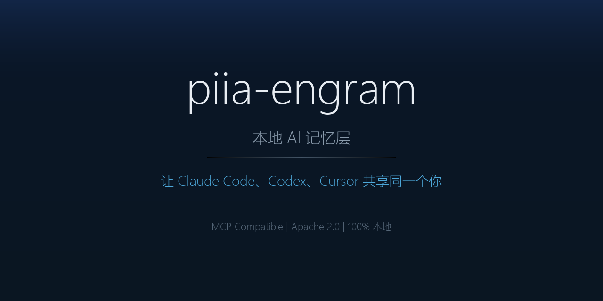

<!-- mcp-name: io.github.Patdolitse/piia-engram -->
<div align="center">



# piia-engram

### 一份记忆，所有 AI 工具，完全属于你

**告诉 AI 一次——你的偏好、标准和经验会跟随你到 Claude Code、Cursor、Codex 等所有 MCP 工具。本地存储，无云端，无账号。**

`跨工具记忆` · `本地优先` · `Claude Code` · `Codex` · `Cursor` · `Windsurf` · `MCP`

[中文](README.zh-CN.md) | [ENGLISH](README.md)

[](LICENSE)
[](https://python.org)
[](https://modelcontextprotocol.io)
[](https://pypi.org/project/piia-engram/)
[](https://pypi.org/project/piia-engram/)
[](https://registry.modelcontextprotocol.io)

</div>

---

> **TL;DR：** piia-engram 把你的身份、偏好、经验教训和关键决策以本地 JSON 文件存储，通过 MCP 让每个 AI 工具读取同一个你。设置一次，所有 AI 都记住你。零云端，Apache 2.0。

---

**每次换工具或开新对话，AI 就忘了你是谁。** piia-engram 解决这个问题。

每次开一个新对话框，你就被忘了。换个工具，又要从头自我介绍。工具一更新，之前设好的偏好可能直接没了。

这是因为现在所有 AI 的记忆都绑在各自的平台上。记忆属于平台，不属于你。平台改了、升了、换了，你的上下文就没了。

**piia-engram 给你跨工具的持久记忆，存在你自己的电脑上。** 你告诉它一次你是谁、你怎么工作、你学到了什么。之后不管你开多少个新对话、用哪个工具、工具怎么更新，AI 开口就认识你。

> **piia-engram 不是 Agent 记忆数据库。** Mem0、Zep、Letta 等工具存的是任务上下文和会话历史。piia-engram 存的是**你这个人**——你的身份、偏好、经验教训和关键决策。这是不同的一层：不是"这次任务做了什么"，而是"所有任务背后的人是谁"。

## 谁在用 piia-engram

piia-engram 为同时使用多个 AI 编程工具、厌倦重复自我介绍的开发者而生。

**如果你在 Claude Code、Codex、Cursor 之间切换** — 代码标准、架构决策、踩过的坑，每次都要重讲。piia-engram 让每个工具从同一个起点认识你。

**如果你每周开 10+ 个 AI 对话框** — 每一个都从零开始。piia-engram 让每次对话从第一条消息就有你的完整上下文。

**如果你因为工具更新丢过偏好** — 你的身份存在自己电脑里，不在任何平台内部。更新、重置、迁移都不影响你的记忆。

<details>
<summary><strong>更多使用场景</strong></summary>

**投资分析师**
决策做了，但推理链丢了。piia-engram 存下每个决策的完整推理，六个月后"我当时为什么放弃那个机会"有真实答案。你的分析框架，不只是笔记，会跟着你进入每一次新分析。

**系统架构师**
架构决策需要上下文：选了什么、排除了什么、为什么。这些内容在 Wiki 里没人读，在记忆里会消失。piia-engram 保存活的架构决策记录，跨公司、跨项目可检索，AI 在你设计下一个系统时可以直接调用。

**后端开发者**
第三方 API 的坑、集成的隐患、性能权衡——这些隐性知识原本只活在你脑子里，换工作就归零。piia-engram 把它们变成可搜索的知识库，在新项目遇到同类问题时主动提醒你。

**前端与设计**
你的设计哲学、真实用户反馈带来的 UX 教训、组件选型背后的理由，很少能以 AI 工具能用的方式记录下来。piia-engram 把这些存成可供 AI 调用的知识，每个新项目都从上一个结束的地方继续。

**Vibe 编程用户**
你用 AI 快速构建，每次开新会话却要重头解释：你的技术栈、你的风格偏好、你不想要的写法。piia-engram 让每个工具从第一条消息就认识你——同样的栈、同样的模式、同样的语气，不用再重复自己。

</details>

## piia-engram 不只是存储

大多数记忆工具是被动的：你放进去，它给你取出来。piia-engram 还是主动的。

**跨项目知识继承**  
描述一个新项目，`get_knowledge_inheritance` 从你所有过往工作中自动提炼最相关的教训和决策，给你一份定制化的起步知识包。第十个项目从前九个的积累中受益——一个工具调用即可获取。

**被动知识捕获**  
把一次会话的摘要粘贴给 `extract_session_insights`，piia-engram 提取并存储其中的教训和决策。不需要手动记笔记，知识通过日常 AI 对话自然积累。

**不支持 MCP 的工具也能用**  
ChatGPT、Gemini、Kimi 没有 MCP 接口。`get_identity_card` 导出一张即粘即用的 Markdown 身份卡，你的 AI 上下文连不能直接连接的工具也能用上。

**自动流程提取**  
完成一个多步骤的操作流程——发布到 PyPI、部署到 Cloudflare、上架到 MCP Registry——piia-engram 在会话结束时自动检测。它生成结构化的 Playbook 草稿（步骤、踩坑记录、触发关键词），存入暂存区。下次遇到同样的任务，AI 找到这份 Playbook 直接按流程走，跳过你已经解决过的坑。无需手动记录——Engram 起草，你确认，AI 完成。详见下方 [Playbook 自动提取](#playbook-自动提取)。

**本地工具图谱**  
AI 工具总是在找本地的程序、运行时和 CLI。`register_tool` 记录已安装的工具和路径；`find_tool` 一步调取。不再每次都 `which python`——环境图谱跨工具、跨会话持久可用。

**知识健康与发现**  
`get_knowledge_overview` 找出久未复查的知识（30 天以上），计算 0–100 健康度评分（新鲜度、质量、覆盖度、清洁度四个维度），提示哪些内容值得重新确认。`suggest_merges` 全库扫描近似重复条目，返回可直接执行的合并命令。`link_knowledge` 把相关教训和决策串联成可导航的知识网络。

## 快速开始（30 秒）

```bash
pip install piia-engram
engram setup
```

安装向导会自动完成：
1. 检测 Python 环境
2. 发现并配置你的 AI 工具（Claude Code、Cursor、Claude Desktop、Codex）
3. **注入 AI 指令**到每个工具的原生配置（`CLAUDE.md`、`.cursorrules`、`AGENTS.md`），确保 AI 主动调用 Engram
4. 引导你录入种子知识（角色、技术栈、语言）
5. 智能导入你已有的 `CLAUDE.md` / `.cursorrules` 规则文件
6. 隐私偏好设置（跨工具同步、匿名使用统计——均可选）
7. **预览你的 AI 身份卡**——安装即见效

设置完成后重启 AI 工具。第一次对话会自动调用 `get_user_context`——AI 已经认识你了。

随时检查健康状态：
```bash
engram doctor        # 诊断所有工具
engram doctor --fix  # 自动修复 + 注入缺失的 AI 指令
```

### 效果预览

```
你   → "帮我重构这个认证模块"

# 没有 piia-engram：AI 从零开始
AI   → "你用什么语言？什么框架？测试偏好是什么？"

# 有 piia-engram：AI 已经认识你
AI   → "根据你偏好 pytest + 90% 覆盖率的标准，以及你 3 月那次事故
        后总结的'认证中间件必须和业务逻辑分离'的经验，我的方案是..."
```

setup 完成后，运行 `engram doctor` 验证一切就绪：

```
$ engram doctor

  Detected 3 AI tool(s):
    [ok] Claude Code — Engram configured
    [ok] Cursor — Engram configured
    [ok] Codex — Engram configured

  [ok] All configured tools look healthy.

  ── Functional Checks ──
    [ok] piia_engram.core importable
    [ok] Engram initialized (~/.engram)
    [ok] Identity loaded (role: 后端开发工程师)
    [ok] quick_context.md ready (4096 bytes)
    [ok] MCP server: 17 tools registered
```

### 各工具配置方法

<details open>
<summary><strong>Claude Code</strong></summary>

```bash
# 自动配置（推荐）
engram setup
# 或手动添加：
claude mcp add piia-engram -- python -m piia_engram.mcp_server
```

</details>

<details>
<summary><strong>Cursor</strong></summary>

添加到 `~/.cursor/mcp.json`：
```json
{
  "mcpServers": {
    "piia-engram": {
      "command": "python",
      "args": ["-m", "piia_engram.mcp_server"]
    }
  }
}
```

</details>

<details>
<summary><strong>Codex (OpenAI)</strong></summary>

添加到 `~/.codex/mcp.json`：
```json
{
  "mcpServers": {
    "piia-engram": {
      "command": "python",
      "args": ["-m", "piia_engram.mcp_server"]
    }
  }
}
```

</details>

<details>
<summary><strong>Claude Desktop</strong></summary>

添加到 `claude_desktop_config.json`：
```json
{
  "mcpServers": {
    "piia-engram": {
      "command": "python",
      "args": ["-m", "piia_engram.mcp_server"]
    }
  }
}
```

</details>

<details>
<summary><strong>Windsurf / Copilot / Cline / 其他 MCP 客户端</strong></summary>

任何支持 MCP stdio 传输的工具都可以使用以下配置：
```json
{
  "mcpServers": {
    "piia-engram": {
      "command": "python",
      "args": ["-m", "piia_engram.mcp_server"]
    }
  }
}
```

不支持 MCP 的工具（ChatGPT、Gemini、Kimi）：在任意 MCP 工具中运行 `get_identity_card`，将导出的 Markdown 身份卡粘贴到对话中。

</details>

## 升级

```bash
pip install --upgrade piia-engram
```

升级后，piia-engram 会在下次启动时自动迁移旧版 MCP 配置，无需手动操作。如果 AI 工具仍然显示"MCP 断开连接"，运行：

```bash
piia-engram doctor        # 查看问题所在
piia-engram doctor --fix  # 一步自动修复
```

修复后重启对应的 AI 工具即可。`doctor` 命令会扫描 Claude Code、Cursor、Claude Desktop 的配置文件，移除过时的 server 条目并修复失效路径。

## 远程部署

在自己的服务器上运行 piia-engram，从任何地方连接使用。

### 服务器配置

```bash
# 安装（含远程支持）
pip install piia-engram[remote]

# 生成认证 token
python -c "import secrets; print(secrets.token_urlsafe(32))"
# 保存输出，例如 "abc123..."

# 以 SSE 模式启动
ENGRAM_AUTH_TOKEN=abc123... python -m piia_engram.mcp_server --transport sse --host 0.0.0.0 --port 8767
```

### 客户端配置（Claude Code）

```json
{
  "mcpServers": {
    "piia-engram": {
      "url": "http://你的服务器:8767/sse",
      "headers": {
        "Authorization": "Bearer abc123..."
      }
    }
  }
}
```

### 客户端配置（Cursor）

```json
{
  "mcpServers": {
    "piia-engram": {
      "url": "http://你的服务器:8767/sse",
      "headers": {
        "Authorization": "Bearer abc123..."
      }
    }
  }
}
```

**安全提醒：**
- 生产环境务必使用 HTTPS，放在 nginx/caddy 反向代理后面并配置 TLS。
- 认证 token 保护你的身份数据，请妥善保管。
- 默认绑定 `127.0.0.1`，仅本地可访问；`0.0.0.0` 仅在反向代理后使用。
- 设置 `ENGRAM_CORS_ORIGINS` 限制跨域访问（如 `https://your-domain.com`）。
- 数据始终在你自己的服务器上，不经过任何第三方云。

## 它解决什么

| 没有 piia-engram | 有 piia-engram |
|------------|-----------|
| 新对话 = 从零开始 | 每次对话都已经认识你 |
| 工具一更新，偏好可能没了 | 身份存在你电脑里，任何更新都不影响 |
| 换工具要重新自我介绍 | Claude Code、Codex、Cursor 共享同一套记忆 |
| 踩过的坑下次还会踩 | 经验教训跨工具、跨会话持续有效 |
| 记忆锁死在某个平台 | JSON 文件存本地，可读可编辑可迁移 |

## 对比

| 特性 | piia-engram | Claude Memory | 手动 CLAUDE.md | Mem0 | Letta (MemGPT) |
|------|--------|--------------|----------------|------|----------------|
| 主要定位 | 跨工具的用户身份 | 单对话记忆 | 单项目笔记 | Agent 向量记忆 | Agent 自编辑记忆 |
| 跨工具协作 | ✅ MCP 原生（60 个工具）| ❌ 仅 Claude | ❌ 单工具 | ⚠ 需逐工具接入 | ⚠ 需逐工具接入 |
| 存储位置 | 本地 JSON (`~/.engram/`) | 云端 | 本地 | 向量库 + Mem0 Cloud | Postgres 或 Letta Cloud |
| 默认本地优先 | ✅ | ❌ | ✅ | ⚠ Cloud 是默认路径 | ⚠ Cloud 是默认路径 |
| 静态加密 | ✅ AES-256-GCM, PBKDF2 600k（可选）| 视云端策略 | ❌ 明文 Markdown | 视存储后端配置 | 视 Postgres 配置 |
| 知识分层（用户审核）| ✅ staging → verified | ❌ | ❌ | ❌ | ❌ |
| 冲突检测 | ✅ | ❌ | ❌ | ❌ | ❌ |
| MCP 原生 | ✅ | n/a | n/a | ⚠ 第三方 | ⚠ 第三方 |
| 价格 | 免费 Apache 2.0 | 含在订阅 | 免费 | 免费 / 云端付费 | 免费 / 云端付费 |

📊 **完整对比**（含「什么场景应该选别家」），见 [`docs/comparison.md`](docs/comparison.md)。

## 量化数据

下列数字每个 minor release 都会刷新：

| | v3.26.0 (2026-05-23) |
|---|---|
| 支持 AI 工具 | **13** 个（4 已验证 + 7 应兼容 + OpenClaw + ChatGPT 回退）|
| MCP 工具数 | **60** 个（默认开放 12 个 Tier-1，`ENGRAM_TOOLS=all` 开放全部 48 个）|
| 知识类型 | **3** 种（经验教训、关键决策、操作手册 Playbook）|
| 测试通过 | **768** 个（单元 + 集成）|
| 代码覆盖率 | **96%** 总体；mcp_server 99%、setup_wizard 93%、storage 100%、core 95% |
| `core.py` 行数 | **1097** 行（v3.14.1 前是 4277 行 — 见 [架构文档](docs/architecture.md)）|
| PBKDF2 轮数 | **600,000**（符合 OWASP 2023+ 推荐；100k 旧密文仍可解密）|
| 加密 | AES-256-GCM，每条数据随机 salt + nonce |
| 冷启动延迟 | < 100 ms（本地 JSON，无网络）|
| 核心功能网络调用 | 默认 **0** —— 除可选的 `read_web_content` 外，遥测仅写本地日志不上传（[详情](docs/telemetry_roadmap.md)）|
| 外部 AI 评测 | 4 个独立 AI 评审了使用统计设计；此前 3 次架构评测（见 [`docs/`](docs/)）|

## 核心功能

| 功能 | 说明 |
|------|------|
| **冷启动上下文** | 新对话开始时调用 `get_user_context`，AI 立即了解你 |
| **经验教训** | `add_lesson` 记录可复用经验，按领域分类，跨工具共享 |
| **关键决策** | `add_decision` 记录选择和理由，保持长期一致性 |
| **操作手册** | `add_playbook` 记录多步骤操作流程（如发布、部署），通过关键词锚点快速调取 |
| **知识输入提速** | 批量写入经验/决策，并从自由文本笔记中提取知识 |
| **用户画像** | 角色、语言、技术水平、工作偏好、质量标准 |
| **项目快照** | 按项目保存上下文，新任务快速接续 |
| **信任边界** | 可从冷启动上下文中过滤指定画像字段 |
| **身份卡导出** | 生成 Markdown 卡片，粘贴到不支持 MCP 的 AI |
| **OpenClaw 兼容** | 导入/导出 SOUL.md、MEMORY.md、USER.md |
| **完整备份** | 一键导出/导入全部数据 |
| **来源追踪** | 每条知识记录来自哪个工具 |
| **知识质量** | 发现久未复查的知识，生成摘要和 Markdown 报告 |
| **知识关联** | 让经验教训和关键决策互相引用，形成知识网络 |

### Tier-1 核心工具（12 个 — 日常工作流）

| 工具 | 功能 |
|------|------|
| `get_user_context` | 冷启动：加载身份 + 知识上下文 |
| `wrap_up_session` | 会话结束：提取知识 + 同步 |
| `add_lesson` | 记录可复用的经验教训 |
| `add_decision` | 记录关键决策及理由 |
| `add_playbook` | 记录操作手册（多步骤流程 + 关键词锚点，方便日后调取） |
| `search_knowledge` | 多词加权搜索经验、决策和操作手册 |
| `get_relevant_knowledge` | 按当前项目检索相关知识 |
| `get_identity_card` | 导出 Markdown 身份卡（给无 MCP 工具用） |
| `update_identity` | 更新身份画像、偏好或质量标准 |
| `get_project_context` | 读取项目快照 |
| `save_project_snapshot` | 保存项目状态 |
| `get_recent_context` | 重启后找回丢失的会话上下文 |

默认只加载以上 12 个核心工具。在 MCP 配置的 `env` 中设置 `ENGRAM_TOOLS=all` 可解锁全部 60 个工具。

### Tier-2 高级工具（48 个 — 知识管理、审查、导入导出）

<details>
<summary>点击展开完整工具列表</summary>

| 工具 | 功能 |
|------|------|
| `register_tool` | 登记本地工具、运行时或 CLI 到环境图谱 |
| `find_tool` | 按名称查找已登记的工具 |
| `list_tools` | 列出所有已登记工具（可按分类筛选） |
| `save_agent_context` | 保存 AI 会话检查点（也会自动运行） |
| `list_agent_sessions` | 浏览各工具的历史会话记录 |
| `refresh_quick_context` | 刷新本地 `quick_context.md` 快照（离线/跨工具快速通路） |
| `get_profile` | 读取身份画像（默认 safe 模式） |
| `get_work_style` | 读取工作方式 |
| `get_preferences` | 读取沟通与工作流偏好 |
| `get_trust_boundaries` | 读取信任边界 |
| `get_quality_standards` | 读取质量标准 |
| `get_playbooks` | 列出已保存的操作手册 |
| `get_playbook` | 获取单条操作手册的完整内容 |
| `get_recent_playbooks` | 按最近使用时间列出操作手册 |
| `update_playbook` | 更新操作手册的步骤、触发词等字段 |
| `archive_playbook` | 归档不再使用的操作手册 |
| `prepare_playbook_execution` | 参数替换后生成可执行的操作计划 |
| `update_execution_step` | 标记步骤为已完成、跳过或失败 |
| `get_execution_status` | 查看操作手册的当前执行进度 |
| `get_lessons` | 列出经验教训 |
| `get_decisions` | 列出关键决策 |
| `get_domains` | 读取领域经验图谱 |
| `get_knowledge_inheritance` | 根据描述生成跨项目知识继承包 |
| `list_projects` | 列出所有项目快照 |
| `extract_session_insights` | 从文本中提取经验和决策 |
| `bulk_add_knowledge` | 批量添加经验或决策 |
| `ingest_notes` | 从自由文本笔记提取结构化知识 |
| `update_knowledge` | 更新一条知识（自动检测类型） |
| `archive_knowledge` | 归档一条知识 |
| `review_knowledge` | 标记知识已复习 |
| `merge_knowledge` | 合并重复知识条目 |
| `link_knowledge` | 建立知识间双向关联 |
| `unlink_knowledge` | 移除知识间双向关联 |
| `get_knowledge_overview` | 知识概览（摘要 + 健康度 + 过期检查） |
| `get_related_knowledge` | 查询关联知识 |
| `find_similar_knowledge` | 按内容查找相似知识 |
| `suggest_merges` | 全库扫描近似重复，返回可执行的合并命令 |
| `get_stale_knowledge` | 列出需要复习的过期知识 |
| `export_knowledge_report` | 导出 Markdown 知识报告 |
| `request_outline_review` | 生成交互式 HTML 知识审查页面 |
| `apply_review` | 处理审查结果（晋升/归档暂存条目） |
| `export_engram` | 导出完整备份 |
| `import_engram` | 导入备份 |
| `export_engram_to_openclaw` | 导出 OpenClaw 格式 |
| `import_engram_from_openclaw` | 导入 OpenClaw 格式 |
| `read_web_content` | 读取网页内容（需 Reader 服务） |
| `get_audit_log` | 查询审计日志 |
| `start_project` | 新项目启动（继承知识 + 建档） |

</details>

## Playbook 自动提取

piia-engram 能自动检测你在会话中完成的多步骤操作流程，并生成结构化的 Playbook 草稿——无需手动记录。

### 工作原理

1. **检测** — 当你调用 `wrap_up_session` 或 `save_agent_context` 时，piia-engram 扫描检查点步骤、操作动词和触发关键词等流程信号。
2. **草稿生成** — 如果检测到操作流程，自动生成包含步骤、踩坑记录、触发关键词和前置条件的 Playbook 草稿。敏感信息（API Key、Token、绝对路径）在存储前自动脱敏。
3. **暂存** — 草稿存入暂存区，不会自动晋升为正式知识。你审查确认后才变成可信的 Playbook。
4. **复用** — 下次遇到类似任务，`search_knowledge` 通过触发关键词匹配到这份 Playbook，AI 按已验证的步骤执行，跳过你已经踩过的坑。

### 设计哲学：Engram 起草，用户确认，AI 完成

Playbook 自动提取不是全自动的。piia-engram 检测流程并生成粗略草稿——但草稿会留在暂存区，等你明确确认后才生效。确认后，AI 工具可以自主完善和执行这份 Playbook。这保证了人在关键环节把关，同时省去了手写操作手册的麻烦。

### 置信度分级

| 级别 | 信号来源 | AI 行为 |
|---|---|---|
| **高（high）** | `save_agent_context` 中有 3 个以上检查点步骤 | AI 主动通知："检测到可复用的操作流程，已生成 Playbook 草稿。" |
| **中（medium）** | 文本检测（触发关键词 + 操作动词） | AI 静默存入暂存区，不通知。 |

### 敏感信息脱敏

草稿存储前自动脱敏以下内容：
- API Key 和 Token（`Bearer`、`sk-`、`ghp_` 等）
- 绝对文件路径（Windows 和 Unix）
- 邮箱地址
- 环境变量中的密钥

### 开关控制

用户可以随时关闭或重新开启 Playbook 自动提取：

- **关闭：** 对 AI 说"关闭 playbook"/"不要自动记录流程"/"停止 playbook"
- **开启：** 对 AI 说"开启 playbook"/"恢复自动记录"/"启动 playbook"

AI 会调用 `update_identity(field="preferences", ...)` 切换 `playbook_auto_extract` 开关。默认**开启**。

### 手动创建 Playbook

无论自动提取是否开启，你都可以随时通过 `add_playbook` 手动创建 Playbook。开关只影响 `wrap_up_session` 时的自动检测。

## 数据格式

piia-engram 的数据全部存储在本地 `~/.engram/`，使用 JSON/Markdown 格式：

```text
~/.engram/
├── schema_version.json          # Schema 版本
├── identity/
│   ├── profile.json             # 你是谁
│   ├── preferences.json         # 你怎么工作
│   ├── quality_standards.json   # 什么算"好"
│   └── trust_boundaries.json    # 谁能看什么
├── knowledge/
│   ├── lessons.json             # 经验教训
│   ├── decisions.json           # 关键决策
│   └── domains.json             # 领域经验
├── playbooks/
│   ├── _index.json              # Playbook 索引
│   └── {playbook_id}.json       # 每条 Playbook 独立文件
├── tools/
│   └── registry.json            # 本地工具环境图谱
├── projects/
│   └── {project_id}.json        # 项目快照
├── contexts/
│   └── {tool_name}/             # AI 会话上下文（按工具分隔）
│       └── {session_id}.md
├── exports/                     # 备份和导出
└── compat/
    └── openclaw/                # OpenClaw 兼容格式
```

所有文件都可以直接打开、编辑、备份、迁移。记忆是你的资产，不是平台的数据。

## 兼容的 AI 工具

| 工具 | 接入方式 | 置信度 |
|------|---------|--------|
| Claude Code | MCP (stdio) | ✅ 已验证 |
| Codex | MCP (stdio) | ✅ 已验证 |
| Cursor | MCP (stdio) | ✅ 已验证 |
| Claude Desktop | MCP (stdio) | ✅ 已验证 |
| Windsurf | MCP (stdio) | 应兼容 |
| GitHub Copilot | MCP (stdio) | 应兼容 |
| Cline | MCP (stdio) | 应兼容 |
| Roo Code | MCP (stdio) | 应兼容 |
| Amazon Q | MCP (stdio) | 应兼容 |
| Augment | MCP (stdio) | 应兼容 |
| Zed | MCP (stdio) | 应兼容 |
| OpenClaw | SOUL.md/MEMORY.md 导入导出 | ✅ 已验证 |
| ChatGPT / Kimi / Gemini | 粘贴身份卡 | 🔧 可用 |

## 诞生故事

piia-engram 是一个人和 AI 一起做出来的。

创始人用 Claude Code 和 Codex 并行工作，AI 帮他写代码，他帮 AI 记住自己。做着做着发现：这个"帮 AI 记住我"的部分，本身就是一个产品。

所以 piia-engram 从第一天起就是自己的用户——它的代码、架构决策、经验教训，全部存在 piia-engram 里，被两个 AI 工具共享读取。

## Built With

piia-engram 由人驱动，AI 工具辅助开发：

| | 角色 |
|------|------|
| [@Patdolitse](https://github.com/Patdolitse) | 创始人 · 产品方向 · 战略决策 · 版权所有者 |
| Claude Code | AI 开发工具 — 架构设计 · 任务规划 · 代码审查 |
| Codex | AI 开发工具 — 代码执行 · 测试 · CI 构建 |

## 常见问题 FAQ

**哪个 MCP 服务器可以在 Claude Code 和 Cursor 之间共享记忆？**
piia-engram。运行 `pip install piia-engram && engram setup`，两个工具就会从 `~/.engram/` 读取同一份身份、偏好和经验教训。无需云端，无需同步服务——它们读的是同一组本地 JSON 文件。

**piia-engram 是什么？**
piia-engram 是 AI 工具的持久记忆层。它将你的身份、偏好、代码标准、经验教训和关键决策以本地 JSON 文件存储在你的电脑上。每个 MCP 兼容的 AI 工具（Claude Code、Codex、Cursor、Windsurf、Claude Desktop）读取同一个上下文，新对话、工具更新、换工具都不会丢失你的信息。

**piia-engram 和官方 MCP memory server 有什么区别？**
官方 `@modelcontextprotocol/server-memory` 存储通用的实体关系知识图谱。piia-engram 专为**开发者身份**设计：它有结构化的用户画像、代码标准、质量要求、经验教训和关键决策字段，加上 60 个知识生命周期管理工具（搜索、审查、合并、跨项目继承）。如果你需要通用实体记忆，用官方 server。如果你希望每个 AI 工具都了解你的编码偏好和过往经验，用 piia-engram。

**piia-engram 和 Mem0、Zep、Letta 等 Agent 记忆工具有什么区别？**
那些工具存的是 Agent 的任务上下文和会话历史——一次工作流中发生了什么。piia-engram 存的是"你这个人"——你的身份、偏好、经验教训和关键决策。这是不同的一层：身份跨工具、跨会话、跨项目持续有效，而任务记忆的范围是单次 Agent 运行。数据是你自己的本地 JSON 文件，可直接编辑。

**为什么不直接用 AGENTS.md / CLAUDE.md / .cursorrules？**
这些配置文件适合**项目级**规则（构建步骤、编码规范）。piia-engram 存的是**你这个人**——你的偏好、经验和决策，跨所有仓库、所有 AI 工具持续生效。两者互补：AGENTS.md 管项目，piia-engram 管人。详细对比见 [docs/comparison.md](docs/comparison.md)。

**可以同时在多个 AI 工具中使用 piia-engram 吗？**
可以。这正是 piia-engram 的主要使用场景。它使用本地文件存储（`~/.engram/`），通过原子写入和文件锁保证一致性。Claude Code、Cursor、Codex 和其他 MCP 客户端可以同时连接。在 Claude Code 中记录的经验教训，Cursor 中立即可用。

**支持哪些 AI 工具？**
任何支持 MCP 协议的工具：Claude Code、OpenAI Codex、Cursor、Claude Desktop、Windsurf、GitHub Copilot、Cline、Roo Code、Amazon Q、Augment、Zed 等。不支持 MCP 的工具（ChatGPT、Gemini、Kimi），可以用 `get_identity_card` 导出 Markdown 身份卡粘贴使用。

**我的数据存在哪里？**
所有数据以 JSON 和 Markdown 文件存储在本地 `~/.engram/` 目录。无需账号，无需订阅。你可以直接打开、编辑、备份或迁移这些文件。可选 AES-256-GCM 加密：`pip install piia-engram[secure]`。

**如何安装 piia-engram？**
```bash
pip install piia-engram
engram setup
```
安装向导会自动检测 AI 工具并配置 MCP。设置完成后重启 AI 工具，AI 会在每次新对话开始时调用 `get_user_context` 认识你。

**升级后 AI 工具显示"MCP server disconnected"，怎么解决？**
在终端运行 `piia-engram doctor --fix`，然后重启 AI 工具。该命令扫描所有已知 MCP 配置，移除旧版 server 条目并修复失效路径，一步完成。

**piia-engram 会把数据发到云端吗？**
不会。所有核心工具均不发起网络请求。可选的匿名使用统计（工具调用计数，绝不包含内容）可在 setup 中开启，**默认关闭**。随时用 `engram telemetry preview` 查看、`engram telemetry off` 关闭。

**piia-engram 有多少个 MCP 工具？**
60 个：12 个 Tier-1 核心工具默认加载（身份、知识、操作手册、项目上下文、会话恢复），48 个 Tier-2 高级工具用于工具图谱、知识管理、审查、导入导出和审计日志。通过 `ENGRAM_TOOLS=all` 开启全部。

**piia-engram 免费吗？**
是的。Apache 2.0 开源，完全免费。无订阅，无云端计费，无厂商锁定。

## 局限性说明

piia-engram 可以正常使用，但以下功能目前尚未实现：

| 方面 | 当前状态 | 计划版本 |
|---|---|---|
| **文件安全** | JSON 写入使用 portalocker 文件锁 + 原子替换 | 后续补充更大并发压力测试 |
| **访问控制** | `restricted_fields` 会从 `get_user_context` 和 `get_profile(safe=true)` 中过滤画像字段 | MCP 不传调用方身份，暂不做复杂 ACL |
| **加密** | 可选字段级 AES-256-GCM 加密，通过 `ENGRAM_SECRET` 环境变量启用。安装 `pip install piia-engram[secure]`。 | 全盘加密（v4.0）|
| **审计日志** | 可选访问审计，通过 `ENGRAM_AUDIT=1` 环境变量启用。日志写入 `~/.engram/audit.log`。 | 按调用方审计（受 MCP 规范限制）|
| **调用方身份** | MCP 协议不传递工具身份 | 受 MCP 规范限制 |
| **并发写保护** | piia-engram JSON 写入已通过文件锁和原子替换保护 | 网络文件系统等边界场景不保证 |

**实际使用建议：**
- 不要在 piia-engram 里存密码、API Key、客户隐私数据
- `~/.engram/` 目录下的文件，本机有读权限的进程都可以读取
- `restricted_fields` 能减少冷启动上下文暴露的画像字段，但不是加密，也不是真正的 ACL

这不是劝你不用 piia-engram —— 而是对它本质的诚实描述：它是一个本地个人 AI 上下文层。用于存储个人偏好、项目决策、技术笔记等内容，今天就可以正常使用。

## 安全配置

### 字段级加密（可选）

加密敏感的用户画像字段（email、phone、location 等）：

```bash
pip install piia-engram[secure]
export ENGRAM_SECRET="选一个强口令"
```

加密后的字段以 `enc:v1:...` 格式存储在 JSON 文件中。不设置 `ENGRAM_SECRET` 时，piia-engram 照常以明文工作（向后兼容）。

### 审计日志（可选）

记录所有读写操作：

```bash
export ENGRAM_AUDIT=1
```

日志以 JSON-lines 格式写入 `~/.engram/audit.log`。可通过 `get_audit_log` 工具或 `grep` 查询。

## CLI 命令

```bash
engram setup            # 交互式安装向导
piia-engram doctor           # 检查配置健康状态（所有 AI 工具）
piia-engram doctor --fix     # 自动修复所有问题
piia-engram stats            # 查看项目增长数据（GitHub + PyPI）
piia-engram stats --log      # 追加统计快照到本地日志
engram telemetry        # 管理匿名使用统计
engram privacy          # 查看 piia-engram 存了什么数据、存在哪里
```

## Contributing

见 [CONTRIBUTING.zh-CN.md](CONTRIBUTING.zh-CN.md)。英文版见 [CONTRIBUTING.md](CONTRIBUTING.md)。

## License

[Apache 2.0](LICENSE) — piia-engram 是自由软件，记忆属于你。
